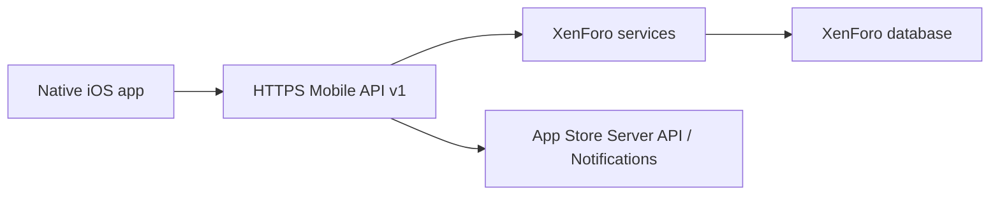

# Architecture

## Proposed System

The iOS app must consume a public HTTPS mobile API. It must not use XenForo database credentials or privileged API keys.

## iOS Layers
- `App`: SwiftUI app target, scenes, app lifecycle, environment selection.
- `Core`: configuration, API client, errors, logging, localization helpers.
- `Authentication`: login, registration, Google/Apple auth, token refresh, logout, Keychain storage.
- `Library`: catalog, search, authors, publishers, saved library, favorites, continue reading.
- `Reader`: PDFKit reader first, EPUB reader only after selecting a maintained legal dependency.
- `Downloads`: background-safe download coordinator, file validation, backup exclusion.
- `Community`: forums, topics, replies, messages, notifications, reporting, blocking.
- `Purchases`: StoreKit 2 products, purchase/restore, server verification.
- `Settings`: profile, privacy, support, account deletion, legal documents.

## Current Android Findings
- Native Compose application with routes for home, catalog, authors, publishers, requests, forum, members, messages, profile, notifications, premium, detail, reader, library, stats, and comments.
- Backend addon exposes `mobile-api/v1` public routes plus XenForo `/api` routes.
- Reader supports remote PDF/EPUB-like downloads, progress updates, access checks, daily read/download quotas, and Google Drive URL fallback.
- Premium exists through Google Play billing placeholder verification.
- Google authentication exists. iOS must add Sign in with Apple if Google auth remains.

## iOS Design Decisions
- Deployment target: iOS 17 for modern SwiftUI, Observation, StoreKit 2, and current App Store SDK compatibility.
- Networking: URLSession + async/await + typed endpoints.
- Sensitive storage: Keychain only.
- Reader: PDFKit for PDF. EPUB dependency must be separately reviewed for license, privacy manifest, maintenance, and App Store risk.
- Payments: StoreKit 2, never Google Play.
- Web rendering: only legal documents or unavoidable rich content, never primary navigation.

## Key Risks
- Public HTTPS staging URL is not provided yet.
- Android billing endpoint is a placeholder and Google-specific.
- Current auth can fall back to `xf_user`/cookie semantics; iOS needs a real short-lived token strategy before release.
- UGC safety is incomplete unless report/block/filter endpoints are completed and tested.
- Content rights for offline downloads must be confirmed before enabling downloaded books in production.
